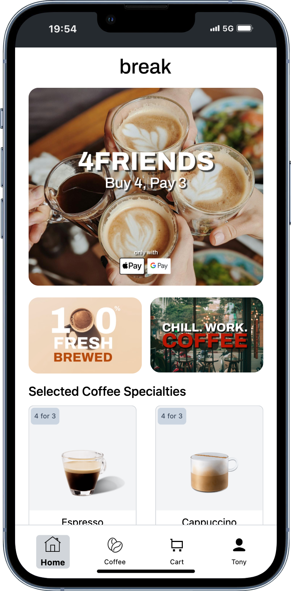
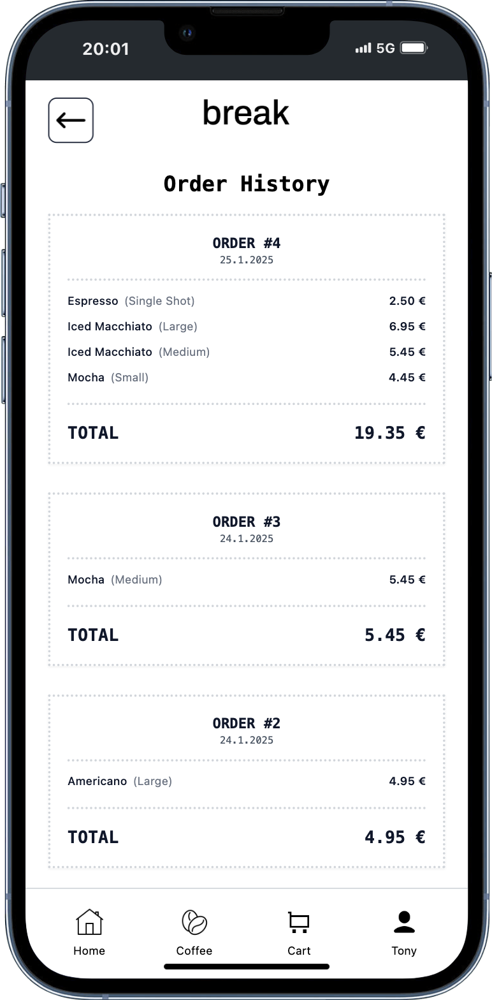
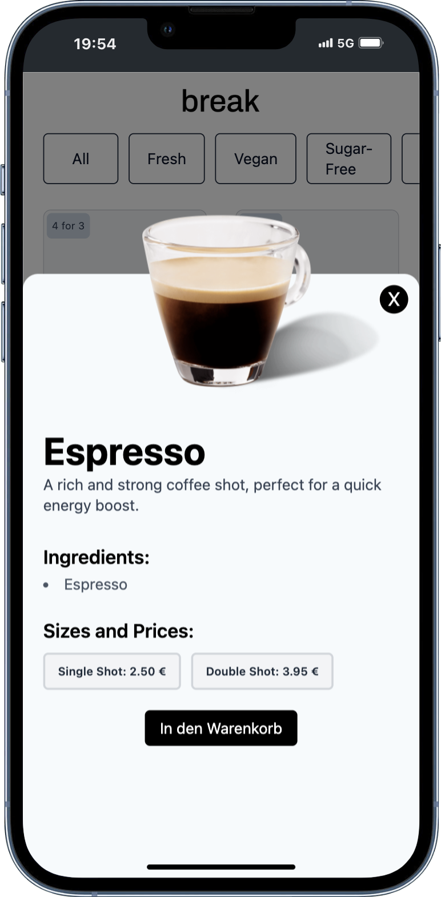
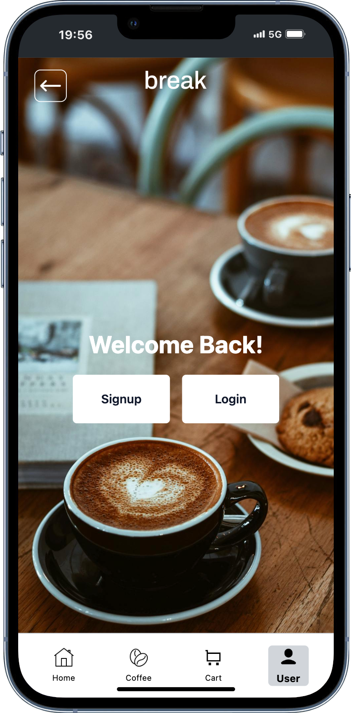

project by [Tolgapp](https://tolgapp.de)

# break - Order a break!

#### Created with React + Typescript and Tailwind

<div style="display: flex; justify-content: center; align-items: center; gap: 1rem; flex-wrap: wrap; width: 100%; margin-top: 4rem">
  
  
  
  
</div>

## Getting Started

1. Clone the repository
2. Install dependencies:
   ```bash
   npm install
   ```
3. Start the development server:
   ```bash
   npm run dev
   ```
4. Open [http://localhost:5173](http://localhost:5173) in your browser

## Live Demo

👉 [Live Demo](https://break-rho.vercel.app)

## Usage

1. Sign up with a random email and password and login with these data
2. After signup and login, select your favorite coffee, add it to the cart and order a fresh brewed coffee and get awake and energized!
3. Enjoy fresh coffee and feel the energy!

## Needed Extensions / Settings

<section  style="display: flex; flex-direction: column; justify-content: center; align-items: center; padding: 0 3rem; margin-top: 4rem">
    <h3>For best experience use Chrome Dev Tools and change it to mobile view to iPhone 12 PRO (optimized for iPhone 12/13/14 PRO)</h3>
    <h3>or download the Mobile Simulator from Chrome web store: https://shorturl.at/H0o0w</h3>
</section>


Icons by @icons8